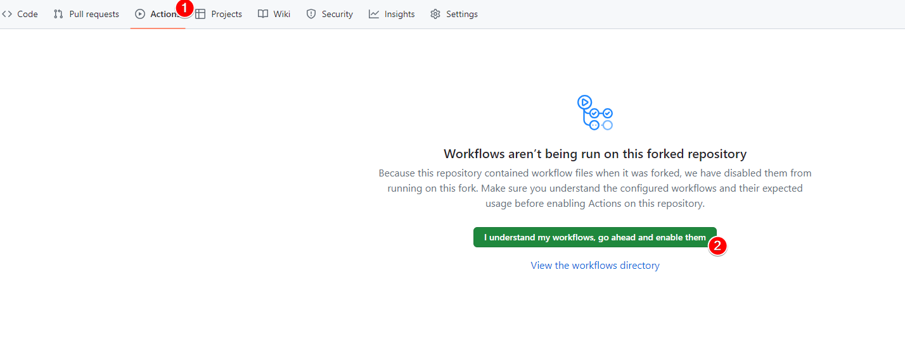
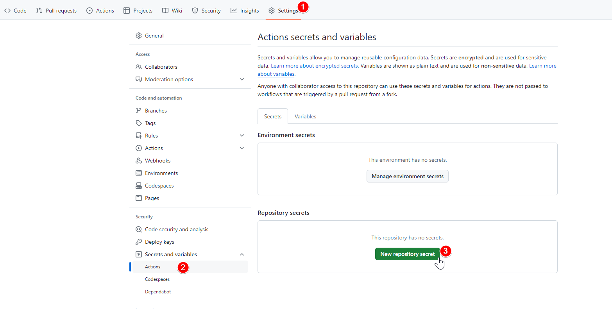
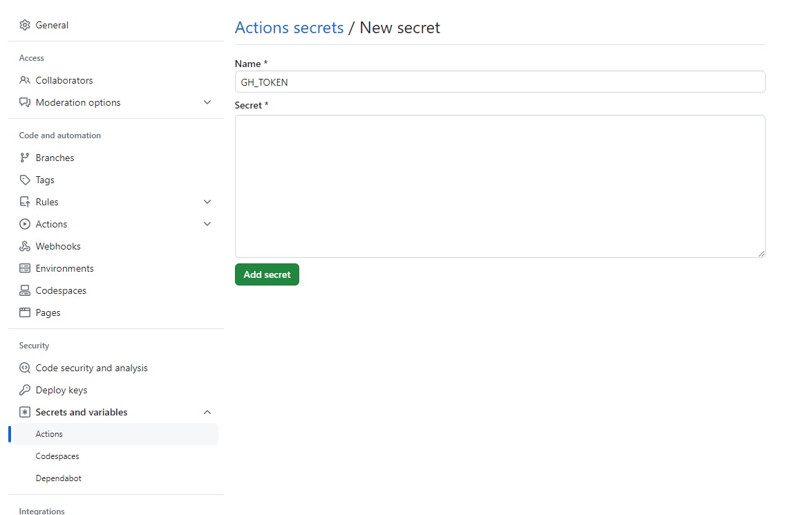
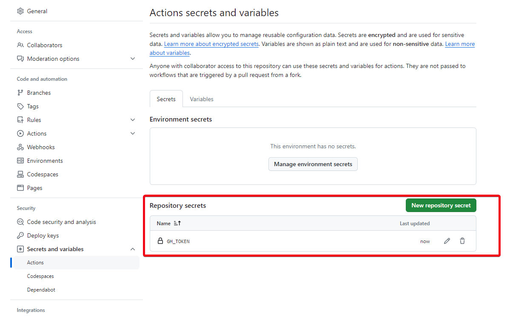
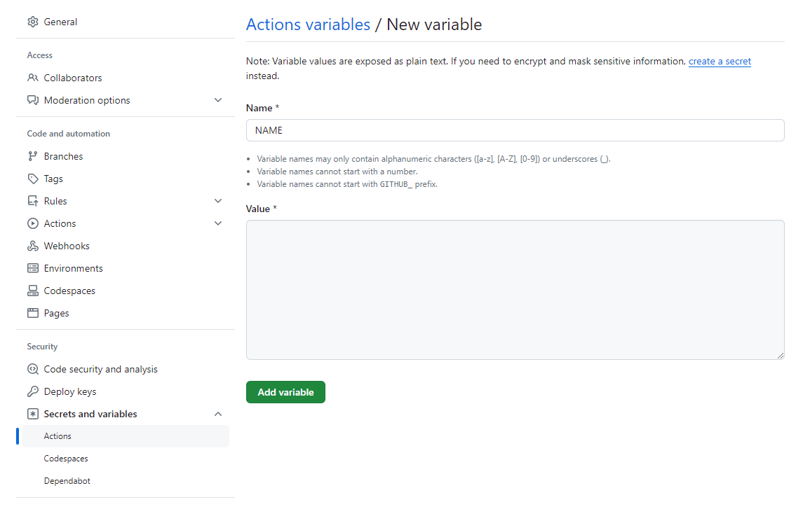
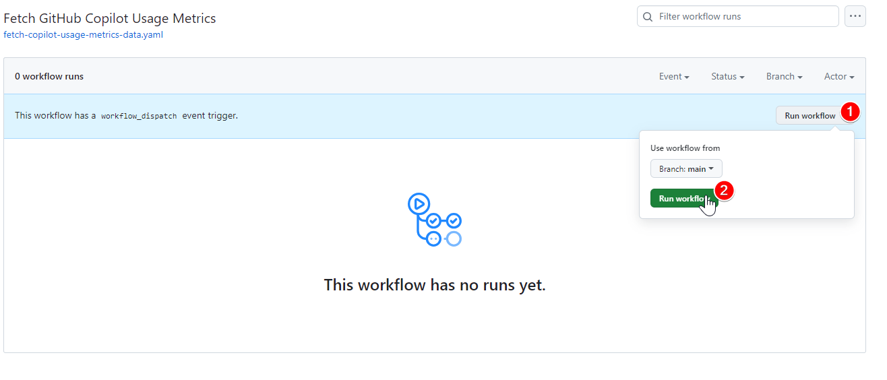
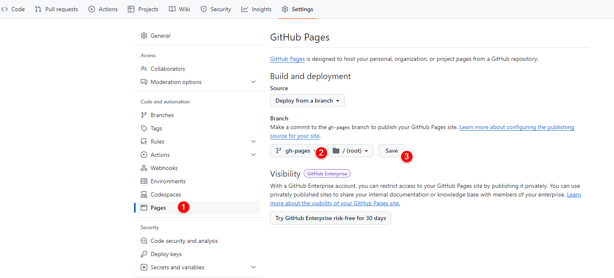
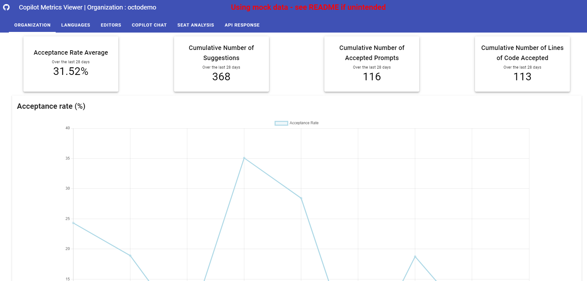

_NOTE: For information on support and assistance, click [here](https://github.com/github-copilot-resources/copilot-metrics-viewer/tree/main?tab=readme-ov-file#support)._

# GitHub Copilot Metrics Viewer
<p align="center">
  
</p>

This application displays a set of charts with various metrics related to GitHub Copilot for your <i>GitHub Organization</i> or <i>Enterprise Account</i>. These visualizations are designed to provide clear representations of the data, making it easy to understand and analyze the impact and adoption of GitHub Copilot. This app utilizes the [GitHub Copilot Metrics API](https://docs.github.com/en/enterprise-cloud@latest/rest/copilot/copilot-usage?apiVersion=2022-11-28).

## Setup GitHub Action

To set up the GitHub Action for fetching and processing GitHub Copilot usage metrics, follow these steps:

1. fork my version：[https://github.com/alantsai-samples/copilot-metrics-viewer/fork](https://github.com/alantsai-samples/copilot-metrics-viewer/fork)

    ​​
2. disable original two GitHub Action which is create container image and deploy to Azure Static Website

    ​​

    ​​

    ​​
3. Setup Required secrets

    ​

    add `GH_TOKEN`​ as Name with the Personal Access Token created from [here](https://github.com/settings/tokens/new?scopes=read:enterprise,manage_billing:copilot) as Secret (need scope : `read:enterprise`​, `manage_billing:copilot`​)

    ​​

    it should look like:

    ​​
4. Setup Variables

    You need to set `NAME`​ as to your organization or enterprise name

    ​​

    ​
5. Execute `Fetch GitHub Copilot Usage Metrics`​ Action

    ​​

    ​​

    this flow is triggered every morning 05:00 at UTC time zone
6. ​`Build and Deploy to GitHub Pages`​ will automatically be triggered when `Fetch GitHub Copilot Usage Metrics`​ is done

    ​​
7. Setup GitHub Pages

    ​`Settings`​ -> `Pages`​ -> `gh-pages`​

    ​​

    ​​

    ​​
8. Try the page

    Click onto the gh-pages and you will see the result

    ignore the `Using mock data - see README if unintended`​ part

    ​​

### Other Reference

There are other GitHub Action Variables that you can set

1. ​`AREA`​ - currently support `org`​ or `enterprise`​. It is used to build up the API url path. Default to `org`​.
2. ​`BRANCH_NAME`​ - When fetch data, it will push default to `data/{NAME}`​ branch.  If you would like to change it, just modify this to what you want

## Workflow Diagram

Below is a diagram illustrating the GitHub Action workflow for fetching, processing, and visualizing GitHub Copilot usage metrics:

```mermaid
graph TD
    subgraph A["Fetch GitHub Copilot Usage Metrics Workflow"]
        Checkout["Checkout code"]
        FetchMetrics["Fetch Copilot Metrics"]
        ProcessMetrics["Process Metrics"]
        CommitData["Commit Processed Data"]
        Checkout --> FetchMetrics
        FetchMetrics --> ProcessMetrics
        ProcessMetrics --> CommitData
        CommitData --> B["Project Codebase"]
    end
    
    B -->|Triggers| G["Build and Deploy"]
    
    subgraph D["Build and Deploy to GitHub Pages Workflow"]
        G -->|Builds and Deploys| C["Copilot Metrics Site"]
    end
```

## Video

https://github.com/github-copilot-resources/copilot-metrics-viewer/assets/3329307/bc7e2a16-cc73-43c4-887a-b50809c08533


## Charts

## Key Metrics
Here are the key metrics visualized in these charts:
1. **Acceptance Rate:** This metric represents the ratio of accepted lines to the total lines suggested by GitHub Copilot. This rate is an indicator of the relevance and usefulness of Copilot's suggestions.
<p align="center">
  
</p>

3. **Total Suggestions** This chart illustrates the total number of code suggestions made by GitHub Copilot. It offers a view of the tool's activity and its engagement with users over time.

4. **Total Acceptances:** This visualization focuses on the total number of suggestions accepted by users. 

<p align="center">
  
</p>

4. **Total Lines Suggested:** Showcases the total number of lines of code suggested by GitHub Copilot. This gives an idea of the volume of code generation and assistance provided.

5. **Total Lines Accepted:** As the name says, the total lines of code accepted by users (full acceptances) offering insights into how much of the suggested code is actually being utilized incorporated to the codebase.

<p align="center">
  
</p>

6. **Total Active Users:** Represents the number of active users engaging with GitHub Copilot. This helps in understanding the user base growth and adoption rate.

<p align="center">
  
</p>

## Languages Breakdown Analysis

Pie charts with the top 5 languages by accepted prompts and acceptance rate are displayed at the top.
<p align="center">
  
</p>

The language breakdown analysis tab also displays a table showing the Accepted Prompts, Accepted Lines of Code, and Acceptance Rate (%) for each language over the past 28 days. The entries are sorted by the number of _accepted lines of code descending_.

<p align="center">
  
</p>

## Copilot Chat Metrics

<p align="center">
  
</p>

1. **Cumulative Number of Turns:** This metric represents the total number of turns (interactions) with the Copilot over the past 28 days. A 'turn' includes both user inputs and Copilot's responses.

2. **Cumulative Number of Acceptances:** This metric shows the total number of lines of code suggested by Copilot that have been accepted by users over the past 28 days.

3. **Total Turns | Total Acceptances Count:** This is a chart that displays the total number of turns and acceptances

4. **Total Active Copilot Chat Users:** a bar chart that illustrates the total number of users who have actively interacted with Copilot over the past 28 days.

## Seat Analysis 
<p align="center">
  
</p>
1. **Total Assigned:** This metric represents the total number of Copilot seats assigned within current organization/enterprise.

2. **Assigned But Never Used:** This metric shows seats that were assigned but never used within the current organization/enterprise. The assigned timestamp is also displayed in the chart.

3. **No Activity in the Last 7 days:** never used seats or seats used, but with no activity in the past 7 days.

4. **No Activity in the last 7 days (including never used seats):** a table to display seats that have had no activity in the past 7 days, ordered by the date of last activity. Seats that were used earlier are displayed at the top.


## Setup instructions

In the `.env` file, you can configure several environment variables that control the behavior of the application.

#### VUE_APP_SCOPE 

The `VUE_APP_SCOPE` environment variable in the `.env` file determines the scope of the API calls made by the application. It can be set to either 'enterprise' or 'organization'.

- If set to 'enterprise', the application will target API calls to the GitHub Enterprise account defined in the `VUE_APP_GITHUB_ENT` variable.
- If set to 'organization', the application will target API calls to the GitHub Organization account defined in the `VUE_APP_GITHUB_ORG` variable.

For example, if you want to target the API calls to an organization, you would set `VUE_APP_SCOPE=organization` in the `.env` file.

````
VUE_APP_SCOPE=organization

VUE_APP_GITHUB_ORG= <YOUR-ORGANIZATION>

VUE_APP_GITHUB_ENT=
````


#### VUE_APP_MOCKED_DATA

To access Copilot metrics from the last 28 days via the API and display actual data, set the following boolean environment variable to `false`:

```
  VUE_APP_MOCKED_DATA=false
```

#### VUE_APP_GITHUB_TOKEN
Specifies the GitHub Personal Access Token utilized for API requests. Generate this token with the following scopes: _copilot_, _manage_billing:copilot_, _manage_billing:enterprise_, _read:enterprise_, _read:org_.

```
  VUE_APP_GITHUB_TOKEN=
```

## Install dependencies
```
npm install
```

### Compiles and runs the application
```
npm run serve
```

### Docker build
```
docker build -t copilot-metrics-viewer .
```

### Docker run
```
docker run -p 8080:80 copilot-metrics-viewer
```
The application will be accessible at http://localhost:8080

## License 

This project is licensed under the terms of the MIT open source license. Please refer to [MIT](./LICENSE.txt) for the full terms.

## Maintainers 

[@martedesco](https://github.com/martedesco)

## Support

This project is independently developed and maintained, and is not an official GitHub product. It thrives through the dedicated efforts of myself ([@martedesco](https://github.com/martedesco)) and our wonderful contributors. A heartfelt thanks to all our contributors! ✨ 

I aim to provide support through [GitHub Issues](https://github.com/github-copilot-resources/copilot-metrics-viewer/issues). While I strive to stay responsive, I can't guarantee immediate responses. For critical issues, please include "CRITICAL" in the title for quicker attention. 🙏🏼

### Coming next 🔮
- Team slicing
- Persistence layer
